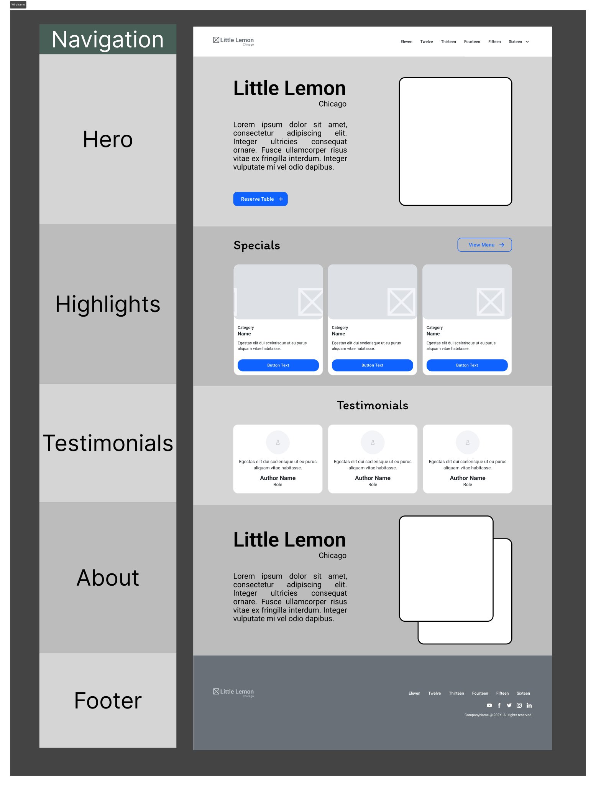

# Little Lemon Restaurant - React App

## 📌 Project Description  
This project is the **Capstone Project** for the **Meta Front-End Developer Professional Certificate**.  
It focuses on building a fully functional **React.js web application** for a fictional restaurant called **Little Lemon**.  

The purpose of this project is to bring together everything learned throughout the specialization — including **React fundamentals, routing, form handling, testing, accessibility, and responsive design** — into a real-world, client-focused application.  

## 👨‍💻 Author  
**Muhammad Awais**  
- Front-End Developer | Web Designer | WordPress & React Enthusiast  
- Portfolio: [https://muhammad-awais-web-dev.github.io/](https://muhammad-awais-web-dev.github.io/)  
- GitHub: [https://github.com/muhammad-awais-web-dev](https://github.com/muhammad-awais-web-dev)  
- LinkedIn: [https://www.linkedin.com/in/muhammad-awais-web-dev](https://www.linkedin.com/in/muhammad-awais-web-dev)  

## 🎯 Project Goals / Needs  
- Develop a **multi-page React application** for Little Lemon.  
- Implement **React Router** for navigation.  
- Create a **table reservation form** with validation and confirmation.  
- Ensure **accessibility and semantic HTML** standards.  
- Apply **responsive design** for mobile, tablet, and desktop.  
- Use **React Testing Library** and **Jest** for testing components.  
- Follow **best practices** in project structure and code quality.  

---

## 🛠️ Tech Stack  
- **React.js** – Front-end library for building UI  
- **React Router** – Navigation and routing  
- **Jest & React Testing Library** – Component and unit testing  
- **CSS (Modules / Plain CSS)** – Styling and responsiveness  
- **Git & GitHub** – Version control and project hosting  

---

## ⚙️ Installation & Setup  

Follow these steps to run the project locally:  

1. **Clone the repository**  
   ```bash
   git clone https://github.com/muhammad-awais-web-dev/little-lemon-capstone.git

2. **Navigate into the project folder**  
   ```bash
   cd little-lemon

3. **Install dependencies**  
   ```bash
   npm install

4. **Run the development server**  
   ```bash
   npm start
5. **Open your browser and go to:**  
    ```
    http://localhost:3000
    ```
---

## 🚀 Project Progress

### Step 1: Setup of the Project

**Overview**  
Before building the Little Lemon React app, the project needed to be set up properly. Instead of coding everything from scratch, a boilerplate React project was initialized and cleaned up for a smooth start.  

This step also included installing helpful VS Code extensions that improve development efficiency and readability.  

**Scenario**  
The goal was to prepare the foundation for the **Reserve a Table** feature of the Little Lemon website by creating and organizing the React project structure.  

---

**Instructions Followed**

1. **VS Code Extensions Installed**
   - **ES7+ React/Redux/GraphQL/React-Native** → Provides React and JavaScript snippets.  
   - **Auto Rename Tag** → Automatically renames paired HTML/JSX tags.  
   - **Trailing Spaces** → Highlights and removes accidental whitespace.  

2. **Created the React Project**  
   ```bash
   npx create-react-app little-lemon
   cd little-lemon
---

### Step 2: First Commit

**Overview**  
After setting up and cleaning the React project in Step 1, the next step was to make the **first commit** and push the changes to the GitHub repository. This ensures the project setup is properly tracked with version control, making it easier to manage progress and collaborate if needed.  

---

**Scenario**  
As development of the Little Lemon React app progresses, every change needs to be committed and pushed to GitHub. This helps in:  
- Keeping a history of project updates  
- Allowing others (or future me) to view and collaborate on the code  
- Providing a backup of the work in case of local issues  

---

**Instructions Followed**

1. **Saved All Updates**  
   - Ensured all modified files were saved in VS Code.  

2. **Staged and Committed Changes**  
   ```bash
   git add --all
   git commit -m "Simplify boilerplate app – removed logo and cleaned App.js"

3. **Pushed Changes to GitHub**  
   ```bash
   git push

4. **Verified on GitHub**
 - Navigated to the Little Lemon repo
 - Confirmed that the new commit appeared in the history with the proper message.

 ---

### Step 3: Created Wireframe

**Overview**  
Before jumping into coding the UI, the homepage and reserve-a-table flow of the Little Lemon website were **wireframed in Figma**. Wireframes act like digital blueprints, focusing on structure and user experience before adding colors, images, or branding.  

This step ensured that the navigation, layout, and core features of the app were mapped out clearly.  

---

**Scenario**  
The Little Lemon website was missing a clear **Reserve a Table** feature. To solve this, the homepage wireframe was created with a dedicated button and proper navigation to highlight this option. Other sections were also planned to ensure a professional and user-friendly structure.  

---

**Instructions Followed**

1. **Client’s Requirements Identified**  
   - About Little Lemon  
   - Highlights and specials  
   - Descriptions and photos of dishes  
   - Navigation bar  
   - Footer  
   - Testimonials  

2. **Created Frame and Grid in Figma**  
   - Frame size: **1440 × 2900 px**  
   - Added a **12-column layout grid**  
   - Created content block placeholders for each section  

3. **Designed Navigation Bar Block**  
   - Logo placeholder  
   - Links: *Home, About, Menu, Reservations, Order Online, Login*  

4. **Designed Hero Section Block**  
   - Title: “Little Lemon”  
   - Location & short description  
   - CTA button: **Book a Table Online**  

5. **Designed Highlights Section**  
   - Weekly specials (dish name, description, price, image)  
   - Horizontal scroll for more dishes  
   - “Order Online” button  

6. **Designed Testimonials Section**  
   - Review placeholders with ratings (out of 5)  
   - Separate background for distinction  

7. **Designed About Section**  
   - Text placeholder for description  
   - Image placeholders for restaurant visuals  

8. **Designed Footer Section**  
   - Logo  
   - Doormat navigation links  
   - Contact details  
   - Social media links  

---



✅ At this stage, the **homepage wireframe** and layout for key pages are complete in Figma.  
This provides a strong foundation to start designing the actual UI and ensures that the **Reserve a Table** feature is properly integrated into the flow.  
